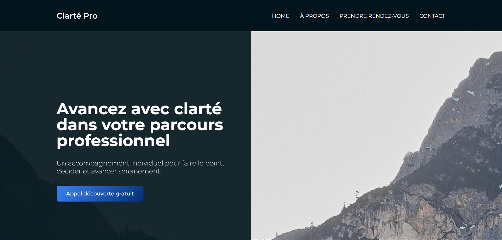

# Clarté Pro - Landing page Coach Professionnel
Landing page conçue pour promouvoir un service fictif et inciter à une action claire.

## 🎯 Objectif
Offrir un aperçu clair de l’accompagnement proposé, expliquer le processus, partager les témoignages et inciter les visiteurs à prendre contact facilement.

## 🖥️ Aperçu

## 🧠 Concept
- Message clair dès la première section (hero) avec un call-to-action visible
- Sections structurées pour présenter l’approche, le fonctionnement et les témoignages
- Formulaire de contact pour réserver un appel découverte
- Design responsive et épuré

## 🛠️ Technologies utilisées
- HTML
- CSS
- JavaScript
- Remix Icon pour les icônes

## ✨ Fonctionnalités
- Navbar responsive avec menu mobile
- Hero section avec texte d’accroche et bouton d’appel à l’action
- Témoignages de clients
- Call-to-action final incitant à réserver un appel
- Formulaire de contact
- Footer avec mentions légales et liens vers les réseaux sociaux

## 📁 Structure du projet
- `/index.html`
- `/style.css`
- `/script.js`
- `images`

## 🚀 Installation et lancement
1. Cloner le dépôt
2. Ouvrir `index.html` dans un navigateur

## 📊 Pistes d’amélioration
- Ajouter des animations supplémentaires sur le scroll
- Intégrer un backend pour gérer les messages du formulaire
- Optimiser le SEO et la performance de chargement

## 👤 Auteur
Amélie Humeau
